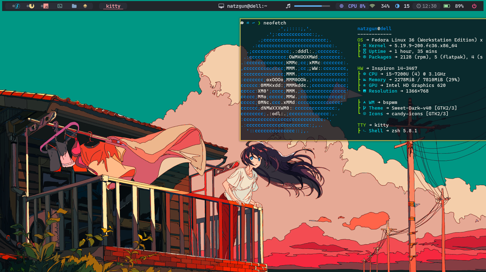

# dotfilesLinux

Mi configuracion para usar un gestor de ventanas en Arch y derivadas

## Configuracion de Nvim

Renombrar las carpetas de "nvimClassic" o "nvimChad" por "nvim" segun desee la configuracion

## Qtile in Arch Linux

## BSPWM + Polybar in Fedora 36

## Custom widgets

#### Rofi

<https://github.com/adi1090x/rofi>

Install theme manually in /usr/share/rofi/themes

#### Neovim Custom

<https://github.com/pojokcodeid>

Install cutom Nvims with de pojokCode configurations
Comming soon... uwu

You have to break my hearth
